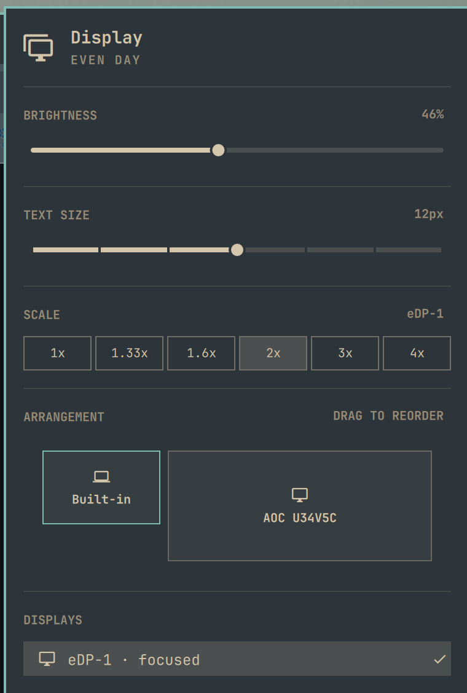

# Display with Monitor Layout for Omarchy

Omarchy's own **Display** widget with exactly one addition: arrange your
displays the way they stand on your desk by dragging them, like the Windows
display settings. An [Omarchy](https://omarchy.org/) shell plugin.

Everything else — brightness, text size, scale, turning displays on and off —
is the unchanged built-in widget, so nothing else in your setup changes.

Hyprland places a hotplugged display wherever its rules say, and on some setups
the result depends on the order the outputs come up. If your external monitor
sits to the right of your laptop but the pointer has to leave through the
*left* edge to reach it, this plugin fixes it and keeps it fixed.



## Features

- **A drop-in Display widget**: a copy of Omarchy's built-in one with a new
  ARRANGEMENT section between SCALE and DISPLAYS. Enabling the plugin puts it
  in place of the built-in widget, and the Display shortcut
  (`SUPER + CTRL + D`) opens it; disabling it brings the built-in one back.
- **Drag-and-drop arrangement**, with tiles scaled to each display's logical
  size (resolution ÷ scale, rotation aware).
- **Any number of displays**, in a single left-to-right row.
- **Sticks across reconnects and reloads.** A background service re-applies the
  layout when a display is plugged in or removed and after every Hyprland
  config reload.
- **Port independent.** Displays are remembered by their description (make,
  model and serial), so a monitor keeps its place on any port or dock.
- **Leaves your config alone.** Only positions are changed, with
  position-only monitor rules; mode, scale, VRR and the rest of
  `~/.config/hypr/monitors.lua` stay as they are. Displays are moved through a
  staging area, so Hyprland never sees an overlapping layout.
- **Keyboard friendly.** In the ARRANGEMENT section `h`/`l` choose a display,
  `Enter` picks it up, `h`/`l` move it, `Enter` drops it.

## Requirements and dependencies

- Omarchy with the Quickshell-based `omarchy-shell` and the `omarchy plugin`
  command.
- Hyprland with the Lua config (0.56 or newer): positions are applied with
  `hyprctl eval`, which the legacy config parser does not support.
- `hyprctl` and `bash`, both already present on Omarchy.

No packages, installers, services, `sudo` or network access are involved. The
plugin runs inside `omarchy-shell` like any other shell plugin.

## Install

```bash
omarchy plugin add https://github.com/kris-1/omarchy-monitor-layout.git --enable
```

`--enable` swaps it in for the built-in Display widget on the bar.

To update later:

```bash
omarchy plugin update monitor-layout
```

## Usage

1. Open the Display widget: click its icon on the bar or press
   `SUPER + CTRL + D`.
2. In the ARRANGEMENT section, drag a display tile to the left or right of the
   others, the way the screens stand on your desk, and release it. The new
   layout applies immediately.
3. Or use the keyboard: `j`/`k` move to the ARRANGEMENT section, `h`/`l`
   choose a display, `Enter` picks it up, `h`/`l` move it, `Enter` drops it,
   `Esc` closes the panel.

The layout is kept when you reconnect a display, dock, or reload Hyprland.

## Configure

- **Bar placement**: `omarchy bar move monitor-layout --section right`
  (`left`, `center` or `right`).
- **Order file**: `~/.config/omarchy/monitor-layout.json` (see
  [How it works](#how-it-works)). You can edit it by hand; the service
  re-applies the layout when the file changes.

The plugin never edits `~/.config/hypr/monitors.lua`; keep mode, scale and
other monitor settings there as usual.

## Remove

```bash
omarchy plugin remove monitor-layout
rm -f ~/.config/omarchy/monitor-layout.json   # optional: forget the saved order
hyprctl reload                                # go back to the positions in monitors.lua
```

Removing the plugin puts the built-in Display widget back on the bar.

## A proposal for Omarchy

Arranging displays belongs in Omarchy's own **Display** widget
(`omarchy.monitor`), next to brightness and scale. A third-party plugin cannot
add a section to a built-in widget, which is the only reason this plugin ships
a whole copy of the widget.

The plugin is built so that it can be merged upstream with little effort:

- `Arrangement.qml` is a self-contained section with a small API (`bar`,
  `active`, `focused`, `cursorActive`, `moveCursor()`, `activate()`,
  `focusRequested`). Dropping it between SCALE and DISPLAYS in
  [`shell/plugins/panels/monitor/Panel.qml`](https://github.com/omacom/omarchy/blob/quattro/shell/plugins/panels/monitor/Panel.qml)
  and adding an `"arrangement"`
  keyboard section is about 40 lines of wiring.
- `Service.qml` would become part of the shell's display services.
- `LayoutModel.js` holds all layout logic as pure functions with unit tests.

**Omarchy maintainers:** if you would like this in the Display widget, I am
happy to open a pull request against
[omacom/omarchy](https://github.com/omacom/omarchy) — let me know in an issue
here or in the Omarchy discussions.

## How it works

| File | Role |
|------|------|
| `Panel.qml` | Omarchy's Display widget with the ARRANGEMENT section added; every change is marked `arrangement`. |
| `Model.js` | Omarchy's Display widget helpers, unchanged. |
| `Arrangement.qml` | The ARRANGEMENT section: live preview, drag-and-drop, keyboard control. Saves the order and applies it immediately. Embeddable in any panel. |
| `Service.qml` | Always-loaded service. Re-applies the saved order on `monitoradded`, `monitorremoved` and `configreloaded`, and when the order file changes. |
| `LayoutApplier.qml` | Reads the order and `hyprctl monitors -j`, then moves the displays in one `hyprctl eval` call — only when something is out of place. |
| `LayoutModel.js` | Pure layout logic (sorting, positions, staging, drop target), unit tested with Node. |

The order lives in `~/.config/omarchy/monitor-layout.json`:

```json
{
  "order": [
    "Lenovo Group Limited 0x8AB1",
    "AOC U34V5C WQVP7HA000383"
  ]
}
```

Entries may be monitor descriptions or output names (`eDP-1`, `HDMI-A-1`).
Displays that are not listed are placed to the right, in their current order.
Displays that are listed but unplugged are remembered for next time.

Positions are computed left to right from `0x0`, top-aligned, with no gaps,
using each display's logical width. Disabled and mirrored outputs are skipped.

## Limitations

- One horizontal row only: stacking a display above or below another is not
  supported yet, and any vertical offset is reset to `0`.
- After a Hyprland config reload the positions from `monitors.lua` apply for a
  moment (about 300 ms) before the service restores the saved layout.
- `Panel.qml` is a copy of Omarchy's Display widget; it is kept in sync with
  upstream by hand, so a new upstream feature may arrive here a little later.

## Development

```bash
git clone https://github.com/kris-1/omarchy-monitor-layout.git
cd omarchy-monitor-layout

scripts/check.sh                 # unit tests + manifest validation
scripts/dev-install.sh --enable  # copy into ~/.config/omarchy/plugins, swap in for Display, restart the shell
```

If you keep your own Display clone, `scripts/dev-install.sh --service-only`
installs just the layout service, without the widget.

`scripts/dev-install.sh` restarts `omarchy-shell` because the plugin hot-reload
can keep a stale copy of the QML cached. `scripts/check.sh` also runs
`qmllint` when it is available (only syntax errors fail; warnings about the
shell's `qs.*` modules are expected outside `omarchy-shell`).

Before a release, test by hand:

- open and close the panel by click, `Esc`, `SUPER + CTRL + D` and
  `omarchy-shell omarchy.monitor open` / `close`;
- brightness, text size, scale and display toggles still work;
- drag a display to each side and check `hyprctl monitors`;
- `hyprctl reload`, unplug and replug a display: the layout comes back;
- `omarchy plugin disable monitor-layout` (the built-in Display comes back),
  `enable`, `omarchy restart shell`, and finally
  `omarchy plugin remove monitor-layout`.

Useful while developing:

```bash
omarchy-shell omarchy.monitor open   # open the Display panel
hyprctl monitors -j | jq '.[] | {name, description, x, y, width, height, scale}'
cat ~/.config/omarchy/monitor-layout.json
```

Shell logs are in `/run/user/$UID/quickshell/by-id/*/log.log`.

## License

[MIT](LICENSE). `Panel.qml` and `Model.js` come from Omarchy, also MIT — see
[NOTICE](NOTICE).
