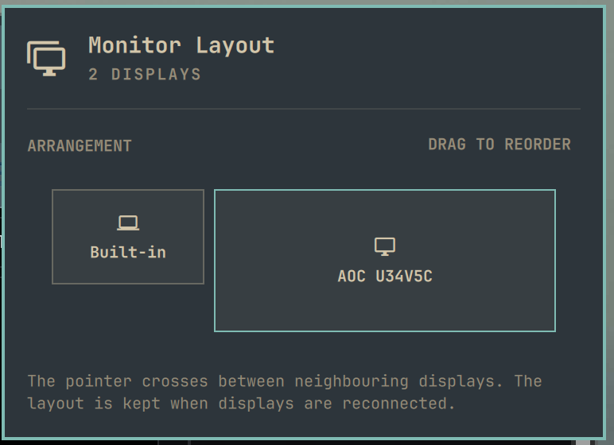

# Monitor Layout for Omarchy

Arrange your displays the way they stand on your desk — by dragging them, like
the Windows display settings. An [Omarchy](https://omarchy.org/) shell plugin.

Hyprland places a hotplugged display wherever its rules say, and on some setups
the result depends on the order the outputs come up. If your external monitor
sits to the right of your laptop but the pointer has to leave through the
*left* edge to reach it, this plugin fixes it and keeps it fixed.



## Features

- **Drag-and-drop arrangement** in a bar popup, with tiles scaled to each
  display's logical size (resolution ÷ scale, rotation aware).
- **Any number of displays**, in a single left-to-right row.
- **Sticks across reconnects and reloads.** A background service re-applies the
  layout when a display is plugged in or removed and after every Hyprland
  config reload.
- **Port independent.** Displays are remembered by their description (make,
  model and serial), so a monitor keeps its place on any port or dock.
- **Leaves your config alone.** Only positions are changed, with
  position-only monitor rules; mode, scale, VRR and the rest of
  `~/.config/hypr/monitors.lua` stay as they are. Displays are moved through a
  staging area, so Hyprland never sees an overlapping layout.
- **Keyboard friendly.** `h`/`l` choose a display, `Enter` picks it up, `h`/`l`
  move it, `Enter` drops it.

## Requirements

- Omarchy with the Quickshell-based `omarchy-shell` and the `omarchy plugin`
  command.
- Hyprland with the Lua config (0.56 or newer); the plugin applies positions
  through `hyprctl eval`.

## Install

```bash
omarchy plugin add https://github.com/kris-1/omarchy-monitor-layout.git --enable
```

Then click the display icon the plugin adds to the bar and drag the tiles into
place.

To update or remove it:

```bash
omarchy plugin update monitor-layout
omarchy plugin remove monitor-layout
```

## A proposal for Omarchy

Arranging displays belongs in Omarchy's own **Display** widget
(`omarchy.monitor`), next to brightness and scale — not behind a second bar
icon. A third-party plugin cannot add a section to a built-in widget, which is
the only reason this plugin ships its own button.

The plugin is built so that it can be merged upstream with little effort:

- `Arrangement.qml` is a self-contained section with a small API (`bar`,
  `active`, `focused`, `cursorActive`, `moveCursor()`, `activate()`,
  `focusRequested`). Dropping it between SCALE and DISPLAYS in
  `shell/plugins/panels/monitor/Panel.qml` and adding an `"arrangement"`
  keyboard section is about 40 lines of wiring.
- `Service.qml` would become part of the shell's display services.
- `LayoutModel.js` holds all layout logic as pure functions with unit tests.

**Omarchy maintainers:** if you would like this in the Display widget, I am
happy to open a pull request against
[basecamp/omarchy](https://github.com/basecamp/omarchy) — let me know in an
issue here or in the Omarchy discussions.

## How it works

| File | Role |
|------|------|
| `Panel.qml` | Bar button and popup hosting the ARRANGEMENT section. |
| `Arrangement.qml` | The ARRANGEMENT section: live preview, drag-and-drop, keyboard control. Saves the order and applies it immediately. Embeddable in any panel. |
| `Service.qml` | Always-loaded service. Re-applies the saved order on `monitoradded`, `monitorremoved` and `configreloaded`, and when the order file changes. |
| `LayoutApplier.qml` | Reads the order and `hyprctl monitors -j`, then moves the displays in one `hyprctl eval` call — only when something is out of place. |
| `LayoutModel.js` | Pure layout logic (sorting, positions, staging, drop target), unit tested with Node. |

The order lives in `~/.config/omarchy/monitor-layout.json`:

```json
{
  "order": [
    "Lenovo Group Limited 0x8AB1",
    "AOC U34V5C WQVP7HA000383"
  ]
}
```

Entries may be monitor descriptions or output names (`eDP-1`, `HDMI-A-1`).
Displays that are not listed are placed to the right, in their current order.
Displays that are listed but unplugged are remembered for next time.

Positions are computed left to right from `0x0`, top-aligned, with no gaps,
using each display's logical width. Disabled and mirrored outputs are skipped.

### Service without the bar button

To keep the layout applied without showing the button (for example when you
arrange displays from your own panel embedding `Arrangement.qml`), list the
plugin under `plugins` instead of `bar.layout` in
`~/.config/omarchy/shell.json`:

```json
"plugins": [{ "id": "monitor-layout" }]
```

## Limitations

- One horizontal row only: stacking a display above or below another is not
  supported yet, and any vertical offset is reset to `0`.
- After a Hyprland config reload the positions from `monitors.lua` apply for a
  moment (about 300 ms) before the service restores the saved layout.

## Development

```bash
git clone https://github.com/kris-1/omarchy-monitor-layout.git
cd omarchy-monitor-layout

scripts/check.sh                 # unit tests + manifest validation
scripts/dev-install.sh --enable  # copy into ~/.config/omarchy/plugins and restart the shell
```

`scripts/dev-install.sh` restarts `omarchy-shell` because the plugin hot-reload
can keep a stale copy of the QML cached.

Useful while developing:

```bash
omarchy-shell monitor-layout open   # open the popup
hyprctl monitors -j | jq '.[] | {name, description, x, y, width, height, scale}'
cat ~/.config/omarchy/monitor-layout.json
```

Shell logs are in `/run/user/$UID/quickshell/by-id/*/log.log`.

## License

[MIT](LICENSE)
